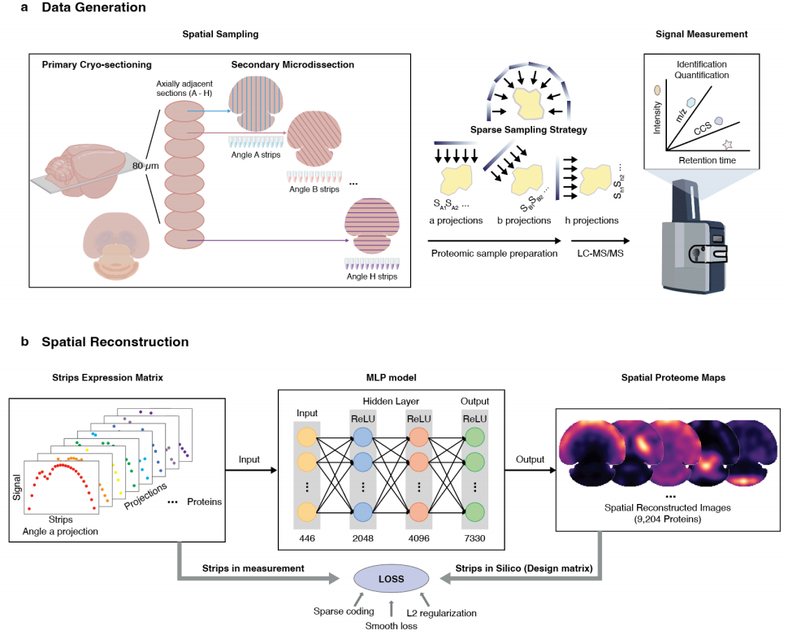

# DeepS4P
In-depth and high-throughput spatial proteomics for whole-tissue slice profiling by deep learning-facilitated sparse sampling strategy

## Reference
Qin, R., Ma, J., He, F. et al. In-depth and high-throughput spatial proteomics for whole-tissue slice profiling by deep learning-facilitated sparse sampling strategy. Cell Discov 11, 21 (2025). https://doi.org/10.1038/s41421-024-00764-y
